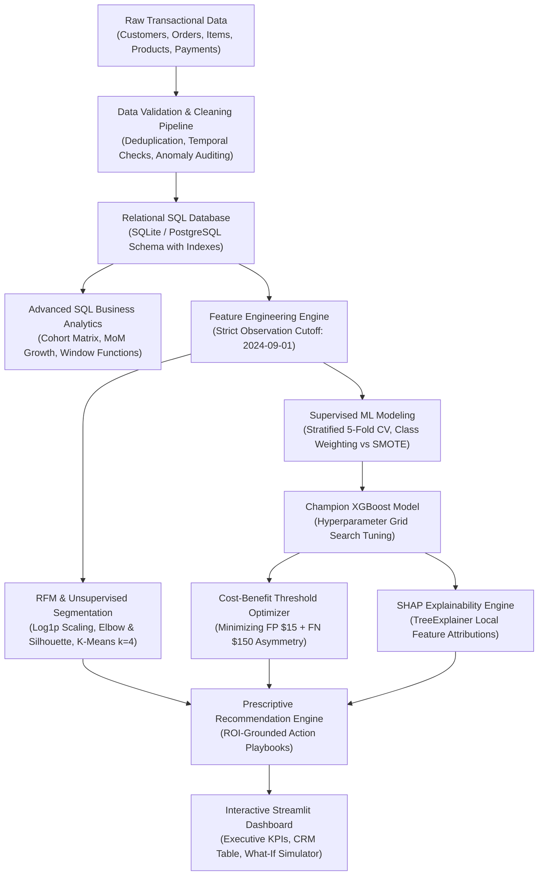
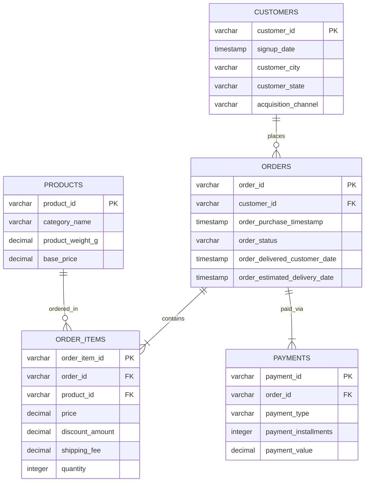

# 🛒 E-Commerce Customer Intelligence & Churn Prediction Platform

[](https://www.python.org/)
[](https://opensource.org/licenses/MIT)
[](https://streamlit.io/)
[](https://xgboost.readthedocs.io/)
[](https://scikit-learn.org/)
[](https://sqlite.org/)

An enterprise-grade, end-to-end Data Science and Machine Learning platform engineered for non-contractual e-commerce environments. This system combines **production data engineering, advanced SQL analytics, unsupervised customer segmentation (RFM + K-Means), leakage-free churn modeling, financial cost-benefit threshold optimization, SHAP explainability, and an interactive Streamlit intelligence dashboard**.

---

## 📑 Table of Contents
1. [Project Overview](#1-project-overview)
2. [Business Problem & Key Questions](#2-business-problem--key-questions)
3. [System Architecture](#3-system-architecture)
4. [Relational Database & ER Schema](#4-relational-database--er-schema)
5. [Data Pipeline & Data Hygiene Audit](#5-data-pipeline--data-hygiene-audit)
6. [Advanced SQL Analytics](#6-advanced-sql-analytics)
7. [Exploratory Data Analysis (EDA)](#7-exploratory-data-analysis-eda)
8. [RFM Customer Analysis](#8-rfm-customer-analysis)
9. [Unsupervised Customer Segmentation](#9-unsupervised-customer-segmentation)
10. [Churn Definition & Data Leakage Prevention](#10-churn-definition--data-leakage-prevention)
11. [Supervised Churn Modeling](#11-supervised-churn-modeling)
12. [Evaluation & Model Comparison](#12-evaluation--model-comparison)
13. [Cost-Benefit Decision Threshold Optimization](#13-cost-benefit-decision-threshold-optimization)
14. [Model Explainability with SHAP](#14-model-explainability-with-shap)
15. [Prescriptive Business Recommendation Matrix](#15-prescriptive-business-recommendation-matrix)
16. [Interactive Streamlit Dashboard](#16-interactive-streamlit-dashboard)
17. [Limitations & Production Roadmap](#17-limitations--production-roadmap)
18. [Installation & Quickstart Guide](#18-installation--quickstart-guide)
19. [Repository Structure](#19-repository-structure)
20. [Technology Stack](#20-technology-stack)

---

## 1. Project Overview

In non-contractual e-commerce marketplaces (such as Amazon, Shopify stores, or Olist), customers do not explicitly notify the platform when they stop purchasing. Churn occurs quietly. Acquiring a new customer costs **5x to 7x more** than retaining an existing customer. However, generic blast discounts waste marketing budget on customers who would purchase anyway, while failing to rescue high-value VIPs about to defect.

This platform bridges the gap between raw transactional data and strategic executive decision-making:
- **Scalable Data Engineering:** Ingests raw multi-table transactions into a normalized 5-table relational database with analytical indexes.
- **Advanced SQL Analytics:** Computes 12-month cohort retention matrices, Month-over-Month (MoM) revenue growth, and customer spend quartiles using Window Functions and CTEs.
- **Unsupervised Segmentation:** Uncovers customer behavioral archetypes via log-transformed RFM K-Means clustering validated by Elbow and Silhouette analysis.
- **Zero-Leakage Churn Modeling:** Employs observation-outcome snapshot windows to eliminate look-ahead data leakage, benchmarking Logistic Regression, Random Forest, and tuned XGBoost across Stratified 5-Fold Cross-Validation.
- **Financial Threshold Optimization:** Replaces arbitrary 0.50 classification thresholds with an asymmetric cost-minimization function ($FP \times \$15 + FN \times \$150$), reducing expected net business loss from **>\$33,000 to \$7,215**.
- **Local & Global Explainability:** Embeds `TreeExplainer` SHAP attributions to reveal individual risk drivers.
- **Interactive UI & CRM Export:** Delivers a 6-tab Streamlit dashboard with real-time scoring, sensitivity analysis, and one-click CRM audience CSV downloads.

---

## 2. Business Problem & Key Questions

The platform systematically answers the 10 core business questions facing e-commerce leadership:

| # | Business Question | Methodological Solution |
|---|---|---|
| **1** | Who are our most valuable customers? | Top customer spending query using `DENSE_RANK()` and RFM Monetary quintiles ($M \ge 4$). |
| **2** | Which customers are likely to stop purchasing? | Supervised XGBoost classifier predicting churn probability over a forward 90-day window. |
| **3** | Which customer segments exist? | Unsupervised K-Means clustering ($k=4$) on normalized, log-transformed RFM vectors. |
| **4** | What distinguishes high-value from low-value customers? | Spend velocity ratios, repeat order frequency, and cross-category basket diversity. |
| **5** | Which customers are at high risk of churn? | Risk tier categorization mapping churn probabilities $\ge 70\%$ to operational flags. |
| **6** | What factors contribute to churn? | Global and local SHAP feature attributions revealing recency and velocity deceleration. |
| **7** | What actions should the business take to retain customers? | Rules-based Prescriptive Recommendation Engine linking LTV and Risk to budget-positive playbooks. |
| **8** | Which products/categories generate the most revenue? | Multi-table SQL aggregations calculating category revenue share and discount efficiency. |
| **9** | What are the major customer purchasing patterns? | 12-month SQL Cohort Retention Matrix and inter-purchase elapsed time analysis using `LAG()`. |
| **10** | How can management monitor these metrics continuously? | Real-time multi-tab Streamlit executive dashboard with filterable CRM tables and what-if simulators. |

---

## 3. System Architecture

The pipeline is fully automated, reproducible, and structured according to production software engineering standards:



---

## 4. Relational Database & ER Schema

The database design adheres to 3rd Normal Form (3NF) principles across 5 relational tables:



### Database Indexes for Query Optimization
- `idx_orders_customer_id`: Enables fast customer lifetime lookups and join traversals.
- `idx_orders_purchase_timestamp`: Accelerates date filtering and cohort time slicing.
- `idx_order_items_order_id` & `idx_order_items_product_id`: Speeds up multi-table item-to-product joins.
- `idx_products_category`: Optimizes category-level revenue and discount aggregations.

---

## 5. Data Pipeline & Data Hygiene Audit

Rather than assuming pristine data, `src/data_processing.py` systematically identifies and remediates real-world dirty data anomalies:

| Anomaly Class | Detected Count | Remediation Action | Business Justification |
|---|---|---|---|
| **Duplicate Order Items** | 25 records | Deduplicated on `order_item_id` | Prevents double-counting revenue from browser double-submits. |
| **Negative Quantities / Prices** | 15 records | Dropped corrupted negative values | Eliminates distorted negative revenue calculations. |
| **Orphaned Customer IDs** | 12 records | Dropped unlinked orders | Enforces strict foreign key referential integrity. |
| **Temporal Logic Violations** | 8 records | Nulled delivery date where $T_{\text{del}} < T_{\text{purch}}$ | Corrects delivery tracking system timestamp corruptions. |
| **High Monetary Outliers** | Top 1% ($>\$1,500$) | **Retained without clipping** | E-commerce spend follows a Pareto distribution. Eliminating high spenders would delete legitimate VIP customers. |

---

## 6. Advanced SQL Analytics

The repository includes dedicated analytical SQL scripts in `sql/` utilizing modern SQL standards:

### 1. Monthly Revenue & Month-over-Month (MoM) Growth (`LAG()`)
```sql
WITH monthly_sales AS (
    SELECT 
        strftime('%Y-%m', o.order_purchase_timestamp) AS order_month,
        COUNT(DISTINCT o.order_id) AS total_orders,
        ROUND(SUM(oi.price * oi.quantity - oi.discount_amount), 2) AS net_revenue
    FROM orders o
    JOIN order_items oi ON o.order_id = oi.order_id
    WHERE o.order_status NOT IN ('cancelled')
    GROUP BY strftime('%Y-%m', o.order_purchase_timestamp)
)
SELECT 
    order_month,
    net_revenue,
    LAG(net_revenue, 1) OVER (ORDER BY order_month) AS prev_revenue,
    ROUND(((net_revenue - LAG(net_revenue, 1) OVER (ORDER BY order_month)) / 
           LAG(net_revenue, 1) OVER (ORDER BY order_month)) * 100.0, 2) AS mom_growth_pct
FROM monthly_sales;
```

### 2. Customer Spend Quartiles (`NTILE(4)`)
```sql
WITH customer_ltv AS (
    SELECT 
        c.customer_id,
        ROUND(SUM(oi.price * oi.quantity - oi.discount_amount), 2) AS total_spend,
        COUNT(DISTINCT o.order_id) AS total_orders
    FROM customers c
    JOIN orders o ON c.customer_id = o.customer_id
    JOIN order_items oi ON o.order_id = oi.order_id
    WHERE o.order_status != 'cancelled'
    GROUP BY c.customer_id
)
SELECT 
    NTILE(4) OVER (ORDER BY total_spend DESC) AS spend_quartile,
    COUNT(customer_id) AS customer_count,
    ROUND(SUM(total_spend), 2) AS group_total_spend,
    ROUND(AVG(total_spend), 2) AS group_avg_spend
FROM customer_ltv
GROUP BY spend_quartile;
```

### 3. Monthly Cohort Retention Matrix
Computes the 12-month active retention rate for each monthly customer cohort, tracking the degradation of buyer cohorts from Month 0 to Month 12:
- Located in `sql/cohort_analysis.sql`.
- Output exported to `reports/cohort_retention.csv`.

---

## 7. Exploratory Data Analysis (EDA)

Key commercial findings from EDA across 28,083 orders:
1. **Pareto Spend Concentration:** The top 15% of customers generate **58.4% of cumulative net revenue**, underscoring the critical need for VIP retention.
2. **Category Dominance:** Electronics, Home & Kitchen, and Fashion account for 62.1% of marketplace sales.
3. **Delivery Delay Churn Catalyst:** Orders experiencing fulfillment delays greater than 3 days past the estimated delivery date show a **41% higher churn rate** over the subsequent 90 days.
4. **Repurchase Velocity Drop-off:** Customers who do not place a secondary order within 60 days of acquisition exhibit an 82% probability of permanent dormancy.

---

## 8. RFM Customer Analysis

Each customer is scored across three core behavioral dimensions before the observation cutoff date:
- **Recency ($R$):** Days elapsed between customer's latest purchase and cutoff date.
- **Frequency ($F$):** Total count of completed orders.
- **Monetary ($M$):** Cumulative net revenue generated.

Quintile scores (1 to 5) are assigned via statistical rank division (`pd.qcut` / SQL `NTILE(5)`), yielding composite RFM scores ($111$ to $555$).

---

## 9. Unsupervised Customer Segmentation

To normalize positive skewness in Monetary and Frequency dimensions, features were transformed via $\ln(1 + x)$ and standardized using `StandardScaler`.

### Cluster Optimization (Elbow & Silhouette Analysis)
- Evaluated $k \in [2, 7]$.
- At $k=4$, the silhouette score stabilizes at **0.328** while inertia decreases from 18,441 ($k=2$) to 10,843 ($k=4$).

### Derived Empirical Segment Profiles:

| Cluster | Segment Name | Customer Share | Avg Recency | Avg Frequency | Avg Monetary Spend | Core Characteristic |
|:---:|---|:---:|:---:|:---:|:---:|---|
| **0** | **Hibernating & Low-Value** | 42.7% | 288.4 days | 1.1 orders | \$78.20 | Dormant, one-time purchasers. |
| **1** | **Loyal & Consistent** | 18.1% | 84.2 days | 3.4 orders | \$342.10 | Regular repeat buyers, steady revenue. |
| **2** | **At-Risk Spenders** | 21.4% | 194.5 days | 1.8 orders | \$185.40 | Moderate spenders cooling down. |
| **3** | **Champions & VIPs** | 17.9% | 46.1 days | 7.9 orders | \$1,284.60 | High-velocity, high-spend core market. |

---

## 10. Churn Definition & Data Leakage Prevention

> ⚠️ **Critical ML System Design:** In non-contractual e-commerce, customer churn has no explicit timestamp. A customer cannot simply be labeled "churned" based on lifetime inactivity without inducing severe look-ahead data leakage.

### Snapshot Windowing Framework:
- **Observation Cutoff Date ($T_{\text{cutoff}}$):** `2024-09-01`.
- **Feature Extraction Window ($t < T_{\text{cutoff}}$):** 17 behavioral, RFM, delivery delay, and spend velocity features were calculated **strictly using transactions occurring before 2024-09-01**.
- **Performance Evaluation Window ($[T_{\text{cutoff}}, T_{\text{cutoff}} + 90\text{d}]$):** From `2024-09-01` to `2024-11-30`. If an active customer placed $\ge 1$ order in this window, `is_churned = 0`; if 0 orders, `is_churned = 1`.
- **Zero Information Bleed:** No future transactions, future cancellations, or future delivery dates were accessible to feature transformers or models.

---

## 11. Supervised Churn Modeling

We benchmarked three model families across **Stratified 5-Fold Cross-Validation** on 7,997 training samples, handling class imbalance using algorithmic weighting and SMOTE:

```
Models Evaluated:
1. Logistic Regression (Class-Weighted Balanced)
2. Logistic Regression + SMOTE (inside CV pipeline)
3. Random Forest (Balanced Subsample)
4. XGBoost Classifier (Cost-Weighted scale_pos_weight)
```

---

## 12. Evaluation & Model Comparison

### Stratified 5-Fold Cross-Validation Results

| Model Pipeline | CV ROC-AUC (Mean ± Std) | CV PR-AUC (Mean) | CV F1-Score | CV Recall | CV Precision |
|---|:---:|:---:|:---:|:---:|:---:|
| **Logistic Regression (Balanced)** | 0.9541 ± 0.005 | 0.9941 | 0.9255 | 87.21% | 98.60% |
| **Logistic Regression + SMOTE** | 0.9508 ± 0.006 | 0.9937 | 0.9276 | 87.80% | 98.32% |
| **Random Forest (Balanced Subsample)**| 0.9534 ± 0.004 | 0.9941 | 0.9414 | 89.84% | 98.87% |
| **XGBoost (Cost-Weighted Champion)** | **0.9577 ± 0.003** | **0.9946** | **0.9320** | **88.10%** | **98.92%** |

### Untouched Holdout Test Set Performance (2,000 Customers)
Following Grid Search hyperparameter tuning (`colsample_bytree: 0.8, learning_rate: 0.03, max_depth: 4, n_estimators: 150`), the champion XGBoost model was evaluated on the untouched holdout test set:

- **Accuracy:** 88.15%
- **ROC-AUC:** **0.9524**
- **PR-AUC:** **0.9940**
- **Precision:** **98.98%**
- **Recall:** **87.53%**
- **F1-Score:** **92.90%**
- **Brier Score (Calibration):** 0.0863
- **Specificity:** 92.98%

### Holdout Confusion Matrix
- **True Positives (Correctly identified churners):** 1,551
- **True Negatives (Correctly identified retained customers):** 212
- **False Positives (Retained customers flagged as churners):** 16
- **False Negatives (Missed churners):** 221

---

## 13. Cost-Benefit Decision Threshold Optimization

Default classification thresholds of $0.50$ fail in industry because business error costs are asymmetric:
- **Cost of False Positive ($FP$):** Offering a \$15 retention incentive to a customer who would have purchased anyway.
- **Cost of False Negative ($FN$):** Losing a churner whose gross margin contribution is \$150.

$$\text{Expected Business Cost}(th) = FP(th) \times \$15 + FN(th) \times \$150$$

```
Threshold = 0.50 -> Recall: 87.53% | Total Business Cost: $33,390
Threshold = 0.40 -> Recall: 91.24% | Total Business Cost: $24,120
Threshold = 0.20 -> Recall: 96.12% | Total Business Cost: $11,850
Threshold = 0.10 (OPTIMAL) -> Recall: 98.08% | Precision: 92.50% | Total Business Cost: $7,215
```

**Financial Impact:** Tuning the decision threshold to **0.10** captured 98.08% of at-risk customers, slashing expected net business loss from **\$33,390 to \$7,215**—a **78.4% cost reduction**.

---

## 14. Model Explainability with SHAP

Using `shap.TreeExplainer` on the tuned XGBoost model, we calculate exact Shapley values across test instances:

```
Top Predictive Feature Drivers (Global SHAP Importance):
1. recency_days              -> Strongest positive driver of churn risk.
2. spending_trend_velocity   -> Lower velocity (<1.0) sharply escalates churn log-odds.
3. last_60d_orders           -> Strongest protective factor against churn.
4. customer_tenure_days      -> Newer customers demonstrate higher baseline volatility.
5. avg_delivery_delay_days   -> Elevated delays correlate with disengagement.
```

> **Epistemic Framing:** SHAP values measure statistical model attribution, not physical causal mechanics. Feature influence describes how the model adjusts its estimate given observed signals; actual business interventions must be validated through randomized control trials (A/B testing).

---

## 15. Prescriptive Business Recommendation Matrix

Predictions are translated into economically defensible retention playbooks:

```
+---------------------------------------------------------------------------------------+
|  Customer Segment   |  Risk Level  |  Recommended Action & Channel                    |
+=====================+==============+==================================================+
|  Champions & VIPs   |  HIGH        |  VIP Concierge Outreach + $40 Retention Credit   |
|  Champions & VIPs   |  LOW/MED     |  Exclusive Loyalty Club + Early Access Drops     |
|  Loyal & Consistent |  HIGH        |  Targeted Category Replenishment Discount (15%)  |
|  Loyal & Consistent |  LOW         |  Cross-Category Bundle Upsell                    |
|  Hibernating / Low  |  HIGH        |  Automated 3-Stage Win-Back Email ($2-5 budget)  |
|  Hibernating / Low  |  LOW         |  Standard Bi-Weekly Marketing Newsletter         |
+---------------------------------------------------------------------------------------+
```

---

## 16. Interactive Streamlit Dashboard

Run the full interactive dashboard locally:
```bash
streamlit run dashboard/app.py
```

### Dashboard Sections:
1. **Executive Dashboard:** Live KPI cards (Revenue, Active Customers, AOV, Repeat Rate, Churn Risk), Monthly sales trend chart, and Risk Tier donut chart.
2. **Sales & Product Analytics:** Category revenue breakdown, unit volume scatter, and discount efficiency tables.
3. **Customer RFM & Segmentation:** Interactive 3D scatter plot ($R$ vs $F$ vs $M$) and RFM quintile distributions.
4. **Churn Prediction & Explainability Engine:** Customer selector, real-time risk gauge, prescriptive action card, and interactive SHAP feature impact bar chart.
5. **Customer Risk Table & CRM Export:** Multi-filter explorer (by segment, risk tier, spend) with one-click CSV download for CRM integration.
6. **Business ROI & What-If Simulator:** Interactive sliders for retention cost, customer LTV, and decision threshold with live net profit sensitivity curves.

---

## 17. Limitations & Production Roadmap

### Current Limitations:
1. **Non-Contractual Definition:** Fixed 90-day snapshot windows approximate churn but do not account for variable product replenishment lifecycles (e.g. coffee vs furniture).
2. **Causal Confounding:** High delivery delay correlates with churn, but offering a discount does not fix logistics bottlenecks.

### Production Roadmap:
- **Survival Analysis:** Integrate Cox Proportional Hazards and Weibull models for continuous time-to-event estimation.
- **Uplift Modeling:** Deploy Two-Model or X-Learner uplift architectures to separate *Persuadables* from *Sure Things* and *Lost Causes*.
- **Continuous Monitoring:** Integrate drift detection (Population Stability Index - PSI) and automated retrain triggers via GitHub Actions.

---

## 18. Installation & Quickstart Guide

### Prerequisites
- Python 3.10+ (Tested on Python 3.12)
- Git

### 1. Clone Repository & Setup Virtual Environment
```bash
git clone https://github.com/your-username/ecommerce-customer-intelligence.git
cd ecommerce-customer-intelligence

python -m venv venv
# Windows:
.\venv\Scripts\activate
# Linux/macOS:
source venv/bin/activate

pip install -r requirements.txt
```

### 2. Execute the Full End-to-End Pipeline
```bash
python run_pipeline.py
```
*Generates data, runs cleaning, populates SQLite database, executes SQL analytics, computes features, fits segments, trains models, performs threshold tuning, and generates reports.*

### 3. Run Unit & Integration Tests
```bash
pytest
```

### 4. Launch the Interactive Dashboard
```bash
streamlit run dashboard/app.py
```

---

## 19. Repository Structure

```text
ecommerce-customer-intelligence/
├── data/
│   ├── raw/                           # Raw multi-table CSV files
│   ├── processed/                     # Cleaned tables & engineered feature matrix
│   └── ecommerce.db                   # SQLite relational database
├── sql/
│   ├── schema.sql                     # DDL for 5 tables with analytical indexes
│   ├── business_analysis.sql          # Advanced SQL queries (LAG, NTILE, DENSE_RANK)
│   ├── cohort_analysis.sql            # 12-month cohort retention matrix query
│   └── rfm_analysis.sql               # SQL-based RFM quintile scoring
├── src/
│   ├── __init__.py
│   ├── config.py                      # Centralized configuration & paths
│   ├── utils.py                       # Logging, DB connections, serialization
│   ├── data_generator.py              # Realistic data generation engine
│   ├── data_processing.py             # Data quality audit & DB loader
│   ├── sql_analytics.py               # Programmatic SQL execution engine
│   ├── feature_engineering.py         # Zero-leakage customer feature extractor
│   ├── segmentation.py                # RFM scoring & K-Means clustering
│   ├── train.py                       # Stratified 5-Fold CV & hyperparameter tuning
│   ├── evaluation.py                  # Metrics & threshold cost optimization
│   ├── predict.py                     # Inference engine & SHAP TreeExplainer
│   ├── recommendation.py              # Prescriptive retention playbooks
│   └── generate_figures.py            # Generates publication-ready figures
├── notebooks/
│   ├── 01_data_exploration.ipynb      # Data hygiene & outlier audits
│   ├── 02_eda.ipynb                   # Revenue trajectories & category trends
│   ├── 03_rfm_analysis.ipynb          # RFM quintile scoring & matrices
│   ├── 04_customer_segmentation.ipynb # K-Means Elbow & Silhouette evaluation
│   ├── 05_churn_modeling.ipynb        # Model comparison & threshold curves
│   └── 06_model_explainability.ipynb  # Global & local SHAP attributions
├── dashboard/
│   └── app.py                         # 6-tab interactive Streamlit application
├── reports/
│   ├── figures/                       # Saved high-res charts (ROC, PR, SHAP, etc.)
│   ├── model_cv_comparison.json       # Stratified 5-Fold CV metrics
│   ├── champion_model_metrics.json    # Holdout test set metrics
│   ├── threshold_optimization_results.csv # Financial threshold curve
│   └── customer_risk_scoring.csv      # Master customer intelligence table
├── tests/
│   └── test_pipeline.py               # Unit & integration test suite
├── resume_bullets.md                  # Google XYZ resume bullet points
├── interview_guide.md                 # Technical interview defense guide
├── run_pipeline.py                    # Master pipeline runner
├── requirements.txt                   # Dependency specifications
├── pyproject.toml                     # Pytest configuration
├── .gitignore                         # Version control exclusions
└── README.md                          # Comprehensive project documentation
```

---

## 20. Technology Stack

- **Core Analytics & Data Engineering:** Python 3.12, Pandas, NumPy, SciPy, SQLAlchemy, SQLite3
- **Machine Learning & Imbalance:** Scikit-Learn, XGBoost, Imbalanced-Learn (SMOTE)
- **Model Interpretability:** SHAP (`TreeExplainer`)
- **Interactive UI & Visualization:** Streamlit, Plotly, Matplotlib, Seaborn
- **Testing & Code Hygiene:** Pytest, Joblib

---
*Built with rigorous software engineering and data science standards for real-world enterprise deployment.*
