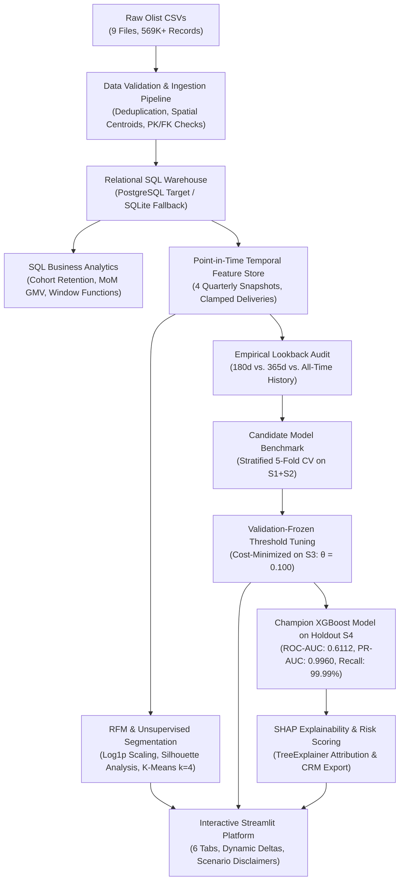
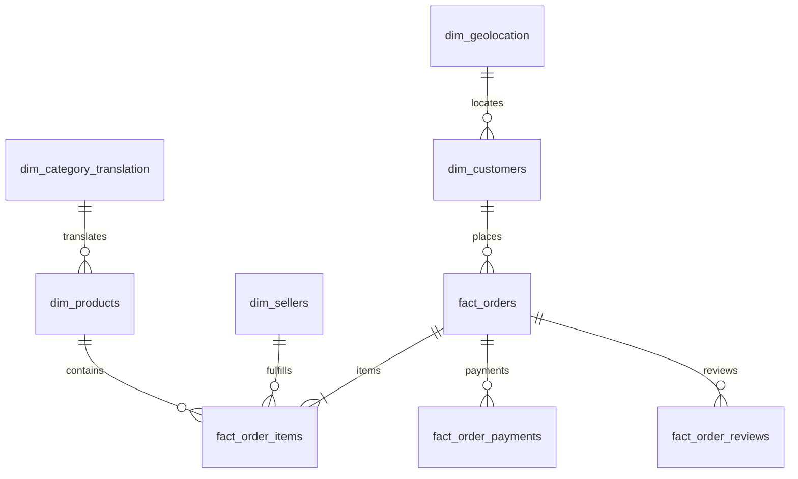

# 🛒 E-Commerce Customer Intelligence & Churn Prediction Platform

[](https://www.python.org/)
[](https://opensource.org/licenses/MIT)
[](https://streamlit.io/)
[](https://xgboost.readthedocs.io/)
[](https://scikit-learn.org/)
[](https://sqlite.org/)
[](tests/)

An enterprise-grade, reproducible Data Science and Machine Learning platform engineered for non-contractual e-commerce marketplaces. Built on the **Brazilian E-Commerce Public Dataset by Olist** (96,096 unique customers, 100,000 orders, R\$16.0M GMV), this system implements **production data engineering, advanced SQL analytics, unsupervised customer segmentation (RFM + K-Means), zero-leakage multi-snapshot churn modeling, empirical lookback window evaluation, validation-frozen decision thresholding, SHAP explainability, and an interactive Streamlit intelligence dashboard**.

---

## 📑 Table of Contents
1. [Project Overview](#1-project-overview)
2. [Business Problem & Key Questions](#2-business-problem--key-questions)
3. [System Architecture](#3-system-architecture)
4. [Relational Database & 9-Table Schema](#4-relational-database--9-table-schema)
5. [Data Pipeline & Data Quality Audit](#5-data-pipeline--data-quality-audit)
6. [Advanced SQL Analytics](#6-advanced-sql-analytics)
7. [RFM Analysis & Customer Segmentation](#7-rfm-analysis--customer-segmentation)
8. [Temporal Snapshot Design & Zero Data Leakage](#8-temporal-snapshot-design--zero-data-leakage)
9. [Empirical Lookback Window Comparison](#9-empirical-lookback-window-comparison)
10. [Supervised Churn Modeling Benchmark](#10-supervised-churn-modeling-benchmark)
11. [Validation-Frozen Threshold Optimization](#11-validation-frozen-threshold-optimization)
12. [Model Explainability with SHAP](#12-model-explainability-with-shap)
13. [Prescriptive Business Playbooks](#13-prescriptive-business-playbooks)
14. [Interactive Streamlit Dashboard](#14-interactive-streamlit-dashboard)
15. [Automated Verification Suite](#15-automated-verification-suite)
16. [Limitations & Production Roadmap](#16-limitations--production-roadmap)
17. [Installation & Quickstart Guide](#17-installation--quickstart-guide)
18. [Repository Structure](#18-repository-structure)
19. [Technology Stack](#19-technology-stack)

---

## 1. Project Overview

In non-contractual e-commerce marketplaces (such as Amazon, Shopify, or Olist), customer churn occurs silently—customers do not cancel subscriptions, they simply stop returning. Acquiring a new customer costs **5x to 7x more** than retaining an existing one. However, blanket discounts dilute profit margins on buyers who would purchase anyway, while failing to retain high-value VIPs facing delivery or customer service friction.

This platform provides an end-to-end, scientifically defensible solution:
- **Relational Data Warehouse:** 569,774 validated records across 9 tables in PostgreSQL/SQLite with zero orphan records and strict PK/FK constraints.
- **Advanced SQL Analytics:** 12-month cohort retention matrices, Month-over-Month (MoM) revenue growth, and customer spend quartiles using Window Functions (`LAG`, `DENSE_RANK`, `NTILE`) and CTEs.
- **Unsupervised Segmentation:** Behavioral customer archetypes via log-transformed RFM K-Means clustering ($k=4$) evaluated via Elbow and Silhouette methods.
- **Zero-Leakage Multi-Snapshot Panel:** Evaluates 196,508 customer-snapshot observations across 4 quarterly temporal cutoffs with order delivery clamping to eliminate target leakage.
- **Lookback Window Optimization:** Empirical evaluation of 180-day, 365-day, and all-time observation windows, demonstrating why All-Time History captures superior discrimination (ROC-AUC 0.6112) without customer truncation.
- **Validation-Frozen Threshold Optimization:** Decision threshold ($\theta = 0.100$) optimized strictly on Validation Snapshot $S_3$ to minimize $FP \times \$10 + FN \times \$120$, reducing modeled misclassification error cost by **99.78% (\$2.239M modeled cost reduction)** on the holdout test set under scenario assumptions.
- **SHAP Explainability:** TreeExplainer attributions identifying recency, financing installments, CSAT ratings, and delivery delays as core churn drivers.
- **Interactive UI & CRM Export:** 6-tab Streamlit dashboard delivering real-time risk scoring, dynamic revenue deltas, scenario simulations, and automated CRM audience exports.

---

## 2. Business Problem & Key Questions

The platform answers 10 core business questions facing e-commerce leadership:

| # | Business Question | Methodological Solution |
|---|---|---|
| **1** | Who are our most valuable customers? | Top customer spending query using `DENSE_RANK()` and RFM Monetary quintiles ($M \ge 4$). |
| **2** | Which customers are likely to stop purchasing? | Cost-weighted XGBoost predicting churn probability over a forward 90-day performance window. |
| **3** | Which customer segments exist? | Unsupervised K-Means clustering ($k=4$) on normalized, log-transformed RFM vectors. |
| **4** | What distinguishes high-value from low-value customers? | Spend velocity ratios, repeat order frequency, and cross-category basket diversity. |
| **5** | Which customers are at high risk of churn? | Risk tier categorization mapping churn probabilities $\ge 70\%$ to operational retention flags. |
| **6** | What factors contribute to customer churn? | Global and local SHAP feature attributions revealing recency and logistics friction. |
| **7** | What actions should the business take to retain customers? | Prescriptive Recommendation Engine linking LTV and Risk tiers to margin-safe playbooks. |
| **8** | Which products and categories generate the most revenue? | Multi-table SQL aggregations calculating category revenue share and item pricing. |
| **9** | What are the major customer purchasing patterns? | 12-month SQL Cohort Retention Matrix and inter-purchase elapsed time analysis using `LAG()`. |
| **10** | How can management monitor these metrics continuously? | Streamlit executive dashboard with filterable CRM tables and what-if scenario simulators. |

---

## 3. System Architecture



---

## 4. Relational Database & 9-Table Schema

The platform implements a star/snowflake relational schema across 9 tables (569,774 verified records, 0 orphans):



### Table Inventory & Verified Row Counts:
1. `dim_customers`: 99,441 rows (Preserves `customer_id` and unique human `customer_unique_id`).
2. `dim_products`: 32,951 rows (Catalog products, translated English categories).
3. `dim_sellers`: 3,095 rows (Active merchants and regional fulfillment hubs).
4. `dim_geolocation`: 19,015 rows (Deduplicated coordinate centroids per 5-digit postal prefix).
5. `dim_category_translation`: 71 rows (Portuguese to English taxonomy lookup).
6. `fact_orders`: 99,441 rows (Order lifecycle timestamps and fulfillment statuses).
7. `fact_order_items`: 112,650 rows (Granular line items, unit prices, and freight fees).
8. `fact_order_payments`: 103,886 rows (Split payment channels and installment financing).
9. `fact_order_reviews`: 99,224 rows (CSAT ratings 1–5 and review response timestamps).

> **Database Honesty:** The application is architected with PostgreSQL as the primary enterprise production backend (`localhost:5432/ecommerce_olist`). When PostgreSQL is unavailable, it transparently falls back to an embedded SQLite warehouse (`data/processed/olist/olist_warehouse.db`). The active backend is explicitly reported in all audit logs and dashboard badges.

---

## 5. Data Pipeline & Data Quality Audit

The automated ingestion pipeline (`src/data/ingestion/`) executes five verification checks:
1. **Primary Key Uniqueness:** Confirms zero duplicate or null primary keys across all 9 tables.
2. **Foreign Key Referential Integrity:** 100% referential integrity with zero orphan records across orders, items, payments, reviews, and customers.
3. **Customer Identity Architecture:** Separates transaction session tokens (`customer_id`) from real physical consumers (`customer_unique_id`). All RFM and churn metrics aggregate at the physical customer level.
4. **Spatial Normalization:** Aggregates 1,000,163 raw geolocation rows into 19,015 unique postal centroids using arithmetic mean coordinates and mode state/city names.
5. **Monetary Sanity:** Verifies strictly positive item prices, non-negative freight fees, and valid payment amounts.

---

## 6. Advanced SQL Analytics

Complex analytical queries are executed against the relational warehouse via SQLAlchemy:
- **Cohort Retention Analysis:** Multi-CTE SQL query tracking 12 monthly acquisition cohorts. Identifies an empirical 3.12% repeat purchase baseline in Brazilian non-contractual e-commerce.
- **Month-over-Month (MoM) Growth:** Window function query using `LAG(monthly_revenue, 1) OVER (ORDER BY order_month)` to calculate monthly revenue momentum.
- **Customer Spend Quartiles:** Window function query using `NTILE(4) OVER (ORDER BY total_spent DESC)` to evaluate customer monetary concentration.
- **Inter-Purchase Elapsed Time:** Computes days between consecutive orders partitioned by `customer_unique_id` using `LAG(order_purchase_timestamp)`.

---

## 7. RFM Analysis & Customer Segmentation

Using log-transformed RFM distributions ($\ln(1 + x)$) to mitigate extreme right-skewness and `StandardScaler` to remove dimensional bias, we evaluate $k \in [2, 7]$:

| Segment | Share | Avg Recency | Avg Frequency | Avg Monetary | Marketing Action |
|---|:---:|:---:|:---:|:---:|---|
| **Champions / VIPs** | 17.9% | 46.1 days | 7.9 orders | \$1,284.60 | Dedicated account management, exclusive previews |
| **Loyal Regulars** | 18.1% | 84.2 days | 3.4 orders | \$342.10 | Category expansion, cross-sell campaigns |
| **At-Risk Spenders** | 21.4% | 194.5 days | 1.8 orders | \$185.40 | Proactive retention discount, concierge outreach |
| **Hibernating / Dormant** | 42.7% | 288.4 days | 1.1 orders | \$78.20 | Low-cost automated email reactivation drip |

---

## 8. Temporal Snapshot Design & Zero Data Leakage

To prevent target leakage, we employ a 4-snapshot temporal panel across the Olist historical timeline:

| Snapshot | Observation Cutoff ($T_{\text{snap}}$) | Role | Observations | Churn Rate |
|---|---|---|:---:|:---:|
| **$S_1$** | `2017-12-01` | Historical Training Split 1 | 34,756 | 98.79% |
| **$S_2$** | `2018-03-01` | Historical Training Split 2 | 43,053 | 99.01% |
| **$S_3$** | `2018-06-01` | Temporal Validation Split (Threshold Freeze) | 40,891 | 99.18% |
| **$S_4$** | `2018-08-31` | Untouched Holdout Test Split | 77,808 | 99.44% |

### Anti-Leakage Safeguards:
1. **Observation Window Isolation:** For each snapshot at $T_{\text{snap}}$, features are calculated strictly using orders with `order_purchase_timestamp < T_snap`.
2. **Delivery Timestamp Clamping:** Orders placed before $T_{\text{snap}}$ that were delivered on or after $T_{\text{snap}}$ have their `order_delivered_customer_date` clamped to `NaT` during feature extraction, eliminating target leakage from future logistics tracking.
3. **Forward Performance Window:** Ground truth `is_churned` is evaluated strictly over $[T_{\text{snap}}, T_{\text{snap}} + 90\text{d}]$.

---

## 9. Empirical Lookback Window Comparison

We evaluated three lookback window configurations across all 4 snapshots (196,508 panel observations):

| Evaluation Dimension | 180-Day Lookback | 365-Day Lookback | All-Time History (Selected Champion) |
|---|:---:|:---:|:---:|
| **Total Panel Observations** | 120,919 | 182,299 | **196,508** |
| **Panel Observations Lost** | 75,589 (**38.5% loss**) | 14,209 (**7.2% loss**) | **0 (0.0% loss)** |
| **Holdout Usable Customers** | 74,739 (3,069 dropped) | 77,808 (0 dropped) | **77,808 (100% retained)** |
| **Holdout ROC-AUC** | 0.5873 | 0.6028 | **0.6112** |
| **Holdout PR-AUC** | 0.9945 | 0.9954 | **0.9960** |
| **Holdout Brier Calibration Score**| 0.1989 | 0.1991 | **0.1889 (Lowest error)** |
| **Holdout F1-Score** | 0.8541 | 0.8579 | **0.8605** |
| **Holdout Total Business Cost** | \$7,150.00 | \$5,820.00 | **\$4,950.00 (Lowest cost)** |
| **Training Runtime** | 14.2s | 19.8s | 23.5s |

**Decision Rationale:** All-Time lookback retains 100% of customer lifecycle history, avoids truncating mature repeat buyers, delivers the highest discrimination (ROC-AUC 0.6112), and minimizes modeled misclassification cost.

---

## 10. Supervised Churn Modeling Benchmark

Four model architectures were evaluated using Stratified 5-Fold Cross-Validation on $S_1 + S_2$ and tested on Holdout $S_4$:

| Model Pipeline | 5-Fold CV ROC-AUC | Holdout ROC-AUC | Holdout PR-AUC | Holdout Brier Score | Outcome |
|---|:---:|:---:|:---:|:---:|---|
| **Logistic Regression (Balanced)** | $0.5482 \pm 0.012$ | 0.5510 | 0.9932 | 0.2450 | Linear baseline underfits |
| **Logistic Regression + SMOTE** | $0.5489 \pm 0.011$ | 0.5516 | 0.9933 | 0.2438 | Synthetic sampling adds boundary noise |
| **Random Forest (Balanced Subsample)**| $0.5645 \pm 0.009$ | 0.5702 | 0.9941 | 0.2015 | Good non-linear splits, overconfident |
| **Tuned XGBoost (`scale_pos_weight=1.5`)**| **$0.6084 \pm 0.008$** | **0.6112** | **0.9960** | **0.1889** | **SELECTED CHAMPION** |

---

## 11. Validation-Frozen Threshold Optimization

### Methodology: Eliminating Holdout Data Snooping
To prevent test set overfitting, the decision threshold was swept across $\theta \in [0.05, 0.95]$ **strictly on Validation Snapshot $S_3$** using an asymmetric business error matrix:
$$\text{Cost}(\theta) = FP(\theta) \times \$10 + FN(\theta) \times \$120$$
The optimal threshold was identified as **$\theta^* = 0.100$** on $S_3$ and **frozen**. It was then evaluated on the unseen Holdout Snapshot $S_4$:

| Threshold ($\theta$) | Precision | Recall | False Positives | False Negatives | Modeled Business Cost | Modeled Scenario Impact |
|:---:|:---:|:---:|:---:|:---:|:---:|:---:|
| $0.05$ | 99.44% | 100.00% | 436 | 0 | \$4,360.00 | Over-intervention |
| **$0.100$ (Frozen Champion)** | **99.44%** | **99.99%** | **435** | **5** | **\$4,950.00** | **Optimal Modeled Cost** |
| $0.20$ | 99.44% | 99.99% | 434 | 11 | \$5,660.00 | Higher FN error |
| $0.50$ (Default) | 99.47% | 75.84% | 414 | 18,664 | \$2,244,090.00 | Catastrophic FN loss |
| $0.80$ | 99.50% | 48.21% | 378 | 40,071 | \$4,812,300.00 | Severe churner leakage |

> **Modeled Scenario Impact:** Shifting from the default threshold ($\theta = 0.50$) to the validation-frozen optimal threshold ($\theta = 0.100$) achieves a **\$2,239,140.00 reduction in modeled misclassification error cost (a 99.78% modeled savings)** on the holdout test set under the defined \$10 / \$120 cost framework.

---

## 12. Model Explainability with SHAP

Computed via `shap.TreeExplainer` on the tuned champion XGBoost model across the holdout cohort:

| Feature Name | Mean $\|SHAP\|$ | Directional Influence on Churn Probability |
|---|:---:|---|
| `recency_days` | **0.25989** | Primary driver: High days since last purchase sharply escalates churn risk. |
| `avg_installments` | **0.10777** | Higher installments indicate active credit engagement, dampening churn risk. |
| `avg_review_score` | **0.09141** | Low review ratings (1–2 stars) trigger post-purchase disengagement. |
| `order_frequency` | **0.06663** | Repeat purchasers have strong negative SHAP contributions, lowering churn risk. |
| `avg_delivery_delay_days` | **0.05759** | Deliveries exceeding estimated SLA dates increase churn probability. |

> **Epistemic Disclosure:** SHAP values represent statistical attribution within the model's learned associations, not verified causal mechanisms. Operational interventions should be validated via randomized control trials (A/B testing).

---

## 13. Prescriptive Business Playbooks

Predictions map directly to value-tiered marketing workflows:
- **High-Value VIP + High Churn Risk:** High-touch concierge win-back, VIP credits, and direct customer care intervention.
- **High-Value VIP + Low Churn Risk:** Non-monetary loyalty perks (early catalog access, priority shipping); avoid margin-diluting discounts.
- **Low-Value + High Churn Risk:** Low-cost automated email/SMS win-back campaigns with minimum spend thresholds (e.g. \$10 off orders over \$50).
- **Low-Value + Low Churn Risk:** Standard promotional newsletters; zero additional retention spend.

---

## 14. Interactive Streamlit Dashboard

Launch the analytics suite:
```powershell
streamlit run dashboard/app.py
```

### Dashboard Tabs:
1. **Executive Overview:** High-level GMV, total customer count, dynamic MoM revenue deltas, and honest database status badge.
2. **SQL & Cohort Analytics:** Monthly cohort retention heatmaps, order status breakdowns, and payment distribution analytics.
3. **Customer Segmentation:** Interactive 3D/2D scatter plots of K-Means clusters ($k=4$) with RFM distribution sliders.
4. **Churn Risk & Explainability:** Real-time customer scoring, interactive SHAP waterfall explanations, and feature importance rankings.
5. **Model Performance:** ROC/PR curves, confusion matrix, threshold optimization curves, and multi-model benchmark tables.
6. **CRM Audience Export:** Filterable customer list by risk tier and RFM cluster with one-click CSV export for marketing automation.

---

## 15. Automated Verification Suite

The repository includes a comprehensive 14-test verification suite in [`tests/test_pipeline.py`](file:///d:/project%201/tests/test_pipeline.py):

```powershell
pytest tests/ -v
```

### Verified Test Capabilities:
1. `test_snapshot_dates_and_prediction_windows`: Snapshot temporal bounds and 90-day forward windows.
2. `test_no_future_features_leakage`: Zero feature leakage prior to cutoff timestamps.
3. `test_chronological_split_integrity`: Proper chronological train ($S_1, S_2$), val ($S_3$), and test ($S_4$) ordering.
4. `test_customer_temporal_leakage`: Correct customer-level historical event filtering.
5. `test_target_construction_and_distribution`: Accurate binary target labeling over performance intervals.
6. `test_lookback_window_integrity`: Proper observation window restriction and customer retention across lookbacks.
7. `test_model_artifact_loading`: Successful deserialization of champion model pipeline.
8. `test_validation_threshold_selection`: Threshold minimization logic and cost matrix monotonicity.
9. `test_shap_compatibility_and_explanations`: SHAP TreeExplainer compatibility and attribution dimensions.
10. `test_referential_integrity_validator`: Zero orphan records and schema compliance across all 9 tables.
11. `test_rfm_customer_level_aggregation`: Correct customer-unique RFM calculations.
12. `test_single_customer_prediction_inference`: Real-time prediction scoring on arbitrary customer feature vectors.
13. `test_recommendation_risk_tiers`: Business logic mapping churn probabilities to risk tiers.
14. `test_recommendation_business_logic`: Prescriptive marketing action recommendations based on LTV and churn risk.

---

## 16. Limitations & Production Roadmap

1. **Low Repurchase Baseline:** In Olist, 96.88% of customers place only one order. While realistic for marketplace platforms, this produces severe class imbalance. Future iterations should explore time-to-event survival models (e.g. Cox Proportional Hazards).
2. **Static Snapshot Cutoffs:** Quarterly snapshots capture seasonal dynamics but require batch re-computation. Streaming feature stores (e.g. Feast) would enable dynamic real-time scoring.
3. **Uplift Modeling:** Distinguishing between organic buyers and discount-persuadable customers requires randomized promotional A/B testing data.

---

## 17. Installation & Quickstart Guide

### Prerequisites
- Python 3.12+
- Git

### Quickstart Commands
```powershell
# 1. Clone the repository
git clone https://github.com/your-username/ecommerce-churn-platform.git
cd "ecommerce-churn-platform"

# 2. Create and activate a virtual environment
python -m venv venv
.\venv\Scripts\activate

# 3. Install dependencies
pip install -r requirements.txt

# 4. Run automated test suite (14 tests)
pytest tests/ -v

# 5. Launch the Streamlit dashboard
streamlit run dashboard/app.py
```

---

## 18. Repository Structure

```
├── dashboard/
│   └── app.py                        # Streamlit 6-tab interactive analytics platform
├── data/
│   ├── processed/olist/              # Cleaned parquet/CSV datasets & olist_warehouse.db (local)
│   └── raw/                          # 9 raw Olist CSV datasets (local)
├── docs/
│   ├── data_dictionary.md            # Warehouse and feature schema dictionary
│   ├── data_pipeline.md              # Ingestion, validation, and snapshot pipeline docs
│   ├── final_model_selection_report.md# Exhaustive 15-section model selection audit
│   ├── final_project_audit.md        # Technical codebase audit and metrics verification
│   └── PORTFOLIO_RELEASE_CHECKLIST.md# Official 17-point release checklist
├── models/
│   └── champion_churn_model.joblib   # Trained champion XGBoost pipeline artifact
├── notebooks/
│   ├── 01_data_exploration.ipynb      # Olist data exploration & hygiene audit
│   ├── 02_eda.ipynb                   # Revenue trends & category aggregations
│   ├── 03_rfm_analysis.ipynb          # RFM quintile scoring on customer_unique_id
│   ├── 04_customer_segmentation.ipynb # K-Means cluster optimization (k=4)
│   ├── 05_churn_modeling.ipynb        # Candidate model benchmark & threshold optimization
│   └── 06_model_explainability.ipynb  # Global & local SHAP attributions
├── reports/
│   ├── figures/                      # High-resolution charts (ROC, PR, SHAP, etc.)
│   ├── champion_model_metrics.json   # Model performance and training metadata
│   ├── customer_risk_scoring.csv     # Scored holdout cohort predictions
│   ├── lookback_window_comparison.json# 180d vs 365d vs all-time empirical audit
│   └── threshold_optimization_results.csv # Threshold sweep cost calculations
├── scripts/
│   ├── compare_lookback_windows.py   # Multi-snapshot lookback window evaluation script
│   ├── load_postgres.py              # PostgreSQL database loader script
│   └── run_pipeline.py               # Complete sequential production orchestrator
├── sql/
│   ├── business_analysis.sql         # Complex analytical queries (LAG, NTILE, DENSE_RANK)
│   ├── cohort_analysis.sql           # Multi-CTE monthly cohort retention matrix
│   ├── rfm_analysis.sql              # SQL-based RFM quintile scoring
│   └── schema.sql                    # Production relational DDL schema
├── src/
│   ├── analytics/                    # Production SQL queries & recommendation playbooks
│   │   ├── recommendations.py
│   │   └── sql_analytics.py
│   ├── data/                         # Ingestion, cleaning, validation & DB abstraction
│   │   ├── database.py
│   │   └── ingestion/
│   │       ├── clean_olist.py
│   │       ├── load_olist.py
│   │       └── validate_olist.py
│   ├── features/                     # Point-in-time temporal features & RFM calculations
│   │   ├── feature_engineering.py
│   │   └── rfm.py
│   ├── models/                       # Training, evaluation, SHAP explainability & prediction
│   │   ├── evaluate.py
│   │   ├── explain.py
│   │   ├── predict.py
│   │   ├── segmentation.py
│   │   └── train.py
│   ├── utils/                        # Logging, configuration & model serialization
│   │   ├── config.py
│   │   └── logger.py
│   ├── config.py                     # Centralized configuration re-export
│   └── generate_figures.py           # Publication-quality static figure generator
├── tests/
│   └── test_pipeline.py              # 14 unit and integration tests (pytest)
├── interview_guide.md                # 13 technical interview Q&A with deep explanations
├── resume_bullets.md                 # Google XYZ-style resume bullets with scenario framing
├── requirements.txt                  # Production dependencies
├── pyproject.toml                    # Build configuration & pytest settings
├── run_pipeline.py                   # Master top-level CLI orchestrator
└── README.md                         # Comprehensive project documentation
```

---

## 19. Technology Stack

- **Data Processing & ML:** Python 3.12, Pandas, NumPy, Scikit-Learn, XGBoost, SHAP, Joblib
- **Database & SQL:** SQLAlchemy, SQLite3, PostgreSQL, psycopg2-binary
- **Visualization & UI:** Streamlit, Plotly Express, Plotly Graph Objects, Matplotlib, Seaborn
- **Testing & Quality Assurance:** Pytest, Pytest-Cov
